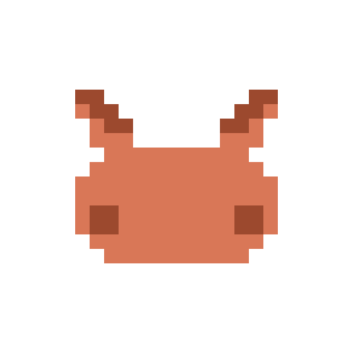

<p align="center"></p>

# PikaMaxxing

Your Claude Code token usage raises pokemon. One plugin, nothing else to
install: your team lives in the band above the prompt, in the terminal and in
the Claude desktop app, and earns from every turn you run.

## Start

1. Sign in at [pikamaxxing.vercel.app](https://pikamaxxing.vercel.app) and open
   your first capsule.
2. In Claude Code:

```
/plugin marketplace add idobry/pikamaxxing-plugin
/plugin install pikamaxxing@pikamaxxing
```

3. Paste the `/pikamaxxing:setup <secret>` line from the "Connect Claude Code"
   card on your trainer page.

## What you get

- **Your pokemon acts out what Claude does:** it charges up while Claude
  thinks, attacks on Bash, swings on edits, shoots on web tools, strikes a
  victory pose when a turn ends, and naps when you step away.
- **Every turn earns tokens** for the pokemon at the front of your team, and
  it evolves on screen when it levels up.
- **Parallel sessions share one scene:** each Claude session brings the next
  pokemon from your team. When they idle together they battle; when they all
  think at once they charge up together.
- **Controls:** switch pokemon (‹ ›), poke it, stop it, minimize the band, or
  open your trainer page. `/pika` shows status and commands.

## Commands

| Command | What it does |
| --- | --- |
| `/pika` | Status and the command list |
| `/pika link <secret>` | Connect this machine to your trainer |
| `/pika stop`, `/pika resume` | Hide or bring back the pokemon |
| `/pika battle` | Start a battle between two open sessions |
| `/pikamaxxing:update` | Update the plugin |

Works in any terminal; Ghostty and kitty show the real pixel sprite. Needs a
Claude Code version with plugin mods.
